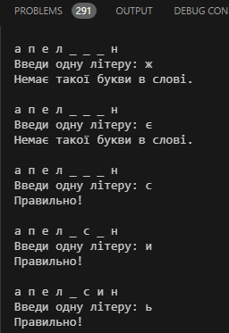

# Звіт до роботи 1  

### Тема: _Вступ. Налаштування середовища розробки та робота з Git_  

### Мета роботи:  
_Налаштувати локальне середовище розробки, створити репозиторій, опанувати форматування Markdown, а також оформити звіт про виконану роботу._  
---  

### Виконання роботи  

* **Результати виконання завдань:**  
    1. Встановив Python і Visual Studio Code.  
    2. Створив власний репозиторій, посилання: [<<<тиць>>>](https://github.com/Taras1Thrytsiv2023?tab=repositories).  
    3. Сформував базову структуру файлів за допомогою Markdown.  
    4. Опанував основні принципи роботи з Git та Markdown.  
    5. Написав просту програму з використанням модуля `random`.  

* Написав [Python-файл](lab_1.py), запустив код програми. 

* **Результати індивідуального завдання:**  
Розробив гру "Вгадай слово". Код програми [тут](lab_1.2.py), а пояснення подано нижче.  



---  

### Програма "Вгадай слово"  

#### Опис коду:  
1. **`import random`** — підключає модуль для роботи з випадковими значеннями.  
2. **Список слів** `word_list` — містить набір слів для гри.  
3. **`random.choice(word_list)`** — обирає випадкове слово з доступного списку.  
4. **Основний цикл гри:**  
   * Відображається поточний стан слова (невгадані літери замінено на "_").  
   * Користувач вводить одну літеру.  
   * Якщо літера є у слові, вона додається в потрібні позиції.  
   * Якщо ні — програма виводить повідомлення, що літери немає.  
5. Гра завершується, коли всі літери вгадані.  

#### Як запустити програму:  
1. Зберегти код у файл `guess_the_word.py`.  
2. Запустити файл через термінал або IDE.  

---  

### Приклад роботи програми:  

```plaintext  
Я загадав слово, спробуй вгадати його!  

_ _ _ _ _  
Введи одну літеру: а  
Правильно!  

_ а _ а _  
Введи одну літеру: п  
Правильно!  

_ а п а _  
Введи одну літеру: е  
Правильно!  

_ а п е _  
Введи одну літеру: р  
Вітаю! Ти вгадав слово 'груша' за 6 спроб.  
```  

---  

### Висновок:  

- **Що зроблено в роботі:** Налаштував середовище розробки, розробив і протестував гру.  
- **Чи досягнуто мети роботи:** Так, усі завдання виконані.  
- **Нові знання:** Досвід роботи з модулями Python та принципами інтерактивної гри.  
- **Складнощі:** Не одразу зрозумів, як відображати поточний стан слова.  
- **Чи подобається такий формат здачі роботи:** Так, формат зручний.  
- **Побажання:** Додати більше прикладів подібних завдань.  

---  
